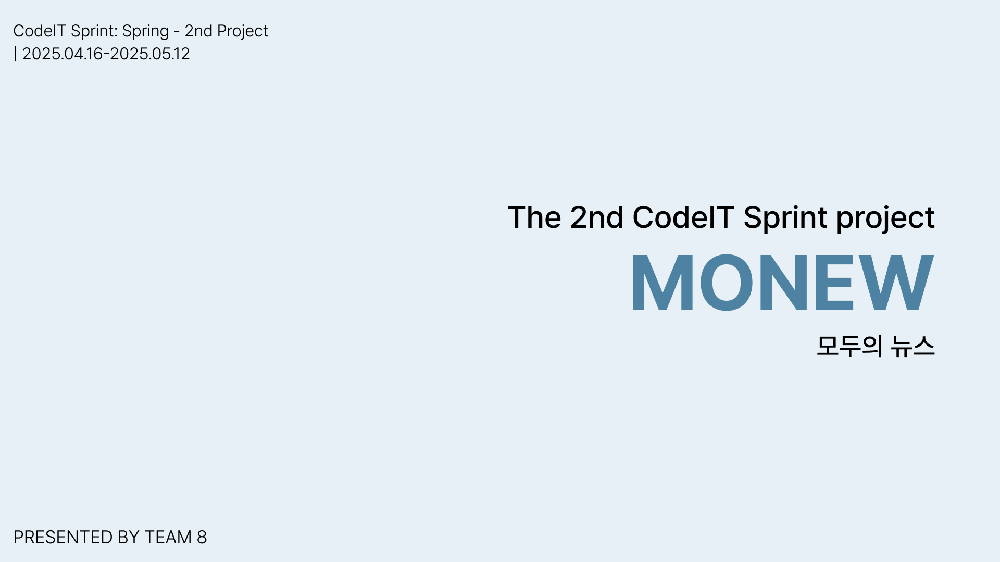

# 📰 MONEW(모두의 뉴스): 맞춤형 뉴스 및 소셜 플랫폼 서비스


<br>

[](https://codecov.io/gh/sb01-team08/sb01-monew-team08/branch/dev)

---

### 📝 협업 문서 링크

[](https://fortunate-tiger-b01.notion.site/SB01_8-1d797c15da0880bab32bfee993b16f60?pvs=4)

### 🌐 구현 링크

[](http://52.79.248.10/)

## 프로젝트 소개

여러 뉴스 API(네이버, 조선, 한경 등)를 통합하여 사용자에게 최적화 된 뉴스를 제공하고, 댓글 기능을 통해 의견을 나눌 수 있는 소셜 뉴스 플랫폼

- 다양한 뉴스 API를 활용하여 최신 뉴스 콘텐츠 제공
- 사용자 간 의견을 나눌 수 있는 소통 중심의 소셜 기능 탑재
- 개인 관심사 기반 맞춤형 뉴스 추천 기능을 통해 정보 탐색 효율 향상

## 개발 기간

2025.04.16-2025.05.12

## 기술 스택

### 💻 Language


### 🧩 Framework


### 🗄 Database


### ⚙ Build & CI/CD


### ☁ Cloud & Infra


### 📈 Monitoring & Docs


### 🧪 테스트 & 품질 관리


### 🛠 기타 도구


## 팀원

| 이름  | 담당                              | Github                                      |
|-----|---------------------------------|---------------------------------------------|
| 한상은 | 팀장 / 인프라 / 사용자, 사용자 활동 내역 관리 기능 | [silvarge](https://github.com/silvarge)     |
| 김창우 | 댓글, 알림 관리 기능 / 테스트 상태 메인 관리     | [cwkim](https://github.com/qwertyuiop4m)    |
| 박태식 | 관심사 기능 / 문서화 메인 관리              | [martin](https://github.com/martinP-Ghub)   |
| 신은섭 | 뉴스 기사 관리 기능 / DB 메인 관리          | [Eunseob Shin](https://github.com/eunseobb) |

## 팀원 별 구현 기능 상세

### 한상은

- 팀 운영 및 일정 관리
    - 전반적인 팀 상황 조율 및 일정 관리 수행
- 인프라 및 배포 자동화
    - AWS ECR 및 EC2 기반 ECS를 활용한 서비스 배포 환경 구성
    - Github Actions 기반 CI/CD 파이프라인 구축
- 사용자 관리 기능 구현
    - 사용자 정보 CRUD 구현
    - 요청 및 응답 헤더 유효성 검증
    - 중복 검사 및 유효성 검사 포함
- 사용자 활동 내역 관리 기능 구현
    - MongoDB 기반 사용자 활동 내역 설계로 조회 성능 최적화
    - 댓글, 좋아요, 뉴스 조회 기록 등 활동 로그 조회 기능 구현
- 입력 검증 및 예외 처리
    - Bean Validation 기반 유효성 검사 적용
    - 전역 예외 처리 및 커스텀 예외 메시지 제공

### 김창우

- 댓글 및 댓글 좋아요 기능 구현
    - 뉴스 기사 댓글 CRUD 구현
    - 댓글 좋아요 등록 및 취소 기능 구현
- 알림 기능 구현
    - 관심사 또는 댓글 좋아요 등에 대한 알림 생성 및 확인 기능 구현
- 테스트 및 품질 관리 총괄
    - QA를 주도하여 기능 동작 안정성 검증
    - 프로젝트의 전체 테스트 커버리지 80% 이상 유지 관리
- 입력 검증 및 예외 처리
    - Bean Validation 기반 유효성 검사 적용
    - 전역 예외 처리 및 커스텀 예외 메시지 제공

### 박태식

- 관심사 기능 구현
    - 사용자 관심사 CRUD 구현
    - 등록 시 유사도(80% 이상) 판단을 통한 중복 등록 방지
    - 관심사 구독 기능 구현
- 문서화 총괄
    - 프로젝트 발표 자료 제작 주도
- 입력 검증 및 예외 처리
    - Bean Validation 기반 유효성 검사 적용
    - 전역 예외 처리 및 커스텀 예외 메시지 제공

### 신은섭

- 뉴스 기사 관리 기능
    - 뉴스 기사 관리 CRUD 구현
    - 기사 관심사 필터링 구현
    - 네이버, 조선일보, 한경 등 외부 뉴스 API 연동을 통한 기사 수집
    - 백업 및 복구 기능 구현
        - AWS S3를 이용한 뉴스 기사 백업 및 복구 기능 구현
- DB 관리 총괄
    - PostgreSQL 기반 스키마 설계 주도
- 배치 작업 설계
    - Spring Batch 기반 뉴스 데이터 처리 배치 구성
- 입력 검증 및 예외 처리
    - Bean Validation 기반 유효성 검사 적용
    - 전역 예외 처리 및 커스텀 예외 메시지 제공

## 파일 구조

```
sb01-monew-team08
└─ src
   ├─ main
   │  ├─ java
   │  │  └─ com
   │  │     └─ example
   │  │        └─ monewteam08
   │  │           ├─ common
   │  │           ├─ config
   │  │           ├─ controller
   │  │           ├─ dto
   │  │           ├─ entity
   │  │           ├─ event
   │  │           ├─ exception
   │  │           ├─ mapper
   │  │           ├─ repository
   │  │           ├─ scheduler
   │  │           ├─ service
   │  │           └─ util
   │  └─ resources
   │     ├─ logback-spring.xml
   │     └─ static
   └─ test
      ├─ java
      │  └─ com
      │     └─ example
      │        └─ monewteam08
      │           ├─ controller
      │           ├─ repository
      │           └─ service
      └─ resources
         ├─ application-test.yml
         ├─ application.yml
         └─ schema.sql
```

## 프로젝트 발표 자료

📄 **[프로젝트 발표 자료 다운로드 (시연 영상 포함)](./presentation.pdf)**

[구글 드라이브로 보기](https://drive.google.com/file/d/1X-3uEZGXJaQa2SgJfpsTimFnkjgLuB_A/view?usp=sharing)

[](./presentation.pdf)

## 시연 영상

[프로젝트 시연 영상](https://drive.google.com/file/d/1A3mGwzeiKCB8r8dppHJxC8ZVW0JZ-zIF/view?usp=sharing)